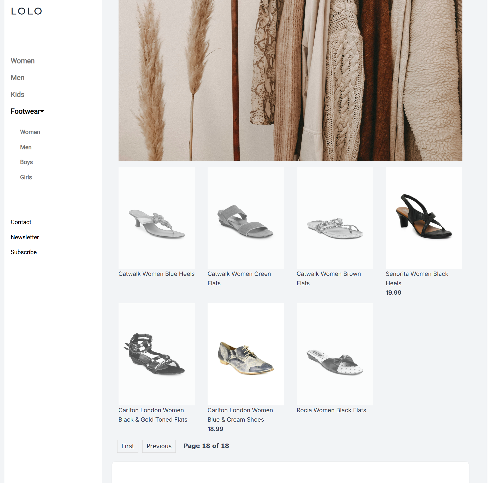

# Django E-Commerce Application

## Overview
This is a fully functional e-commerce application built with Django. It includes features like product listing, category filtering, user authentication, shopping cart management, and stock tracking. The application also supports **role-based views** for different types of users (`is_staff`, `is_customer`, `is_sales`).

---


## Features
- **User Authentication**: Login, logout, and user-specific cart management.
- **Role-Based Views**:
  - **Staff Users**: Can view and manage all products.
  - **Sales Users**: Can view products with high stock availability.
  - **Customers**: Can view and purchase in-stock products.
- **Product Management**: Products are categorized by gender and type (e.g., Shoes, Flip Flops, Socks).
- **Shopping Cart**: Add, update, and remove items from the cart.
- **Stock Management**: Products are marked as "Out of Stock" when unavailable.
- **Pagination**: Products are displayed with pagination for better navigation.
- **Dynamic Templates**: Templates are reused with conditional rendering for different product categories.

---

## User Roles and Views

### 1. **User Roles**
The `UserProfile` model defines three roles:
- **`is_staff`**: Staff users who can manage all products.
- **`is_customer`**: Regular customers who can browse and purchase products.
- **`is_sales`**: Sales users who can view products with high stock availability.

#### Example `UserProfile` Model:
```python
class UserProfile(AbstractBaseUser, PermissionsMixin):
    email = models.EmailField(max_length=255, unique=True)
    name = models.CharField(max_length=255)
    is_staff = models.BooleanField(default=False)
    is_customer = models.BooleanField(default=True)
    is_sales = models.BooleanField(default=False)

    objects = UserProfileManager()

    USERNAME_FIELD = 'email'
    REQUIRED_FIELDS = ['name']
```

---

### 2. **Role-Based Views**
The application uses conditional logic in views to render different content or redirect users based on their roles.

#### Example: Role-Based Product View
```python
@login_required(login_url='login')
def product_list(request):
    if request.user.is_staff:
        products = Product.objects.all()
        paginator = Paginator(products, 10)  # Show 10 products per page
        page_number = request.GET.get('page')  # Get the current page number from the URL
        page_obj = paginator.get_page(page_number)  # Get the products for the current page
        return render(request, 'product-list.html', {'page_obj': page_obj})
    else:
        products = Product.objects.filter(stock__gt=0)
        paginator = Paginator(products, 10)  # Show 10 products per page
        page_number = request.GET.get('page')  # Get the current page number from the URL
        page_obj = paginator.get_page(page_number)  # Get the products for the current page
        return render(request, 'product-list.html', {'page_obj': page_obj})
```

---



---

### 3. **Role-Based Cart View**
The cart view is customized based on user roles:
- **Staff Users**: Can view all cart items.
- **Customers**: Can view only their own cart items.

#### Example:
```python
@login_required
def cart_view(request):
    if request.user.is_staff:
        # Staff can see all cart items
        cart_items = CartItem.objects.all()
    else:
        # Customers see only their own cart items
        cart_items = CartItem.objects.filter(user=request.user)

    total_price = sum(item.product.price * item.quantity for item in cart_items)

    return render(request, 'cart.html', {
        'cart_items': cart_items,
        'total_price': total_price,
    })
```

---

### 4. **Role-Based Redirects After Login**
Users are redirected to different dashboards based on their roles after login.

#### Example:
```python
def login_redirect(request):
    if request.user.is_staff:
        return redirect('staff_dashboard')
    elif request.user.is_sales:
        return redirect('sales_dashboard')
    elif request.user.is_customer:
        return redirect('customer_dashboard')
    else:
        return redirect('login')
```
---

## Key Features in Code

### Product Filtering
Products are filtered by gender and category using Django's ORM:
```python
products = Product.objects.filter(Gender='Women', category__name__in=['Shoes', 'Flip Flops', 'Socks'])
```

### Shopping Cart
Add products to the cart:
```python
cart, created = Cart.objects.get_or_create(user=request.user)
cart_item, created = CartItem.objects.get_or_create(cart=cart, product=product)
```

### Stock Management
Check if a product is in stock:
```python
if product.stock > 0:
    # Add to cart
else:
    messages.error(request, "Product is out of stock.")
```

---

## Installation

### 1. Clone the Repository
```bash
git clone https://github.com/your-repo/django-ecommerce.git
cd django-ecommerce
```

### 2. Create a Virtual Environment
```bash
python -m venv venv
source venv/bin/activate  # On Windows: venv\Scripts\activate
```

### 3. Install Dependencies
```bash
pip install -r requirements.txt
```

### 4. Configure the Database
Run migrations to set up the database:
```bash
python manage.py makemigrations
python manage.py migrate
```

### 5. Create a Superuser
```bash
python manage.py createsuperuser
```

### 6. Run the Development Server
```bash
python manage.py runserver
```

Visit the application at `http://127.0.0.1:8000`.

---

## Usage

### Product Listing
- Products are displayed by category (e.g., Men, Women, Kids).
- Use the navigation bar to filter products by gender or type.

### Shopping Cart
- Add products to the cart using the "Add to Cart" button.
- View the cart at `/cart/`.
- Update or remove items directly from the cart.

### Admin Panel
- Manage products, categories, and stock levels via the Django admin panel at `/admin/`.

---

## Project Structure
```
django_ecommerce/
├── shop/
│   ├── models.py        # Product and Cart models
│   ├── views.py         # Views for product listing and cart management
│   ├── templates/       # HTML templates
│   ├── urls.py          # URL routing for the shop app
│   └── static/          # Static files (CSS, JS, images)
├── home/
│   ├── views.py         # Home page and authentication views
│   ├── templates/       # Base templates
│   └── urls.py          # URL routing for the home app
├── manage.py            # Django management script
└── requirements.txt     # Python dependencies
```


## Dependencies
- **Django**: Backend framework
- **Bootstrap/W3.CSS**: Frontend styling
- **Font Awesome**: Icons for buttons and navigation

Install all dependencies using:
```bash
pip install -r requirements.txt
```

---

## License
This project is licensed under the MIT License. See the `LICENSE` file for details.

---